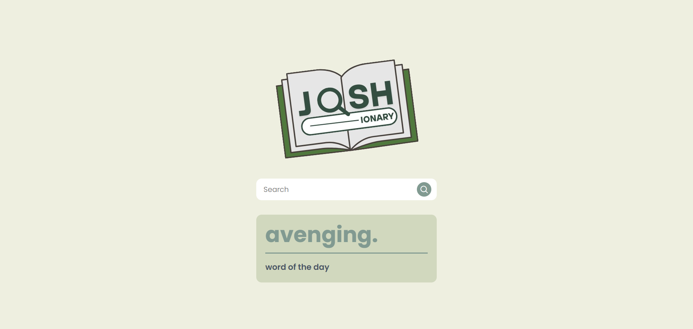
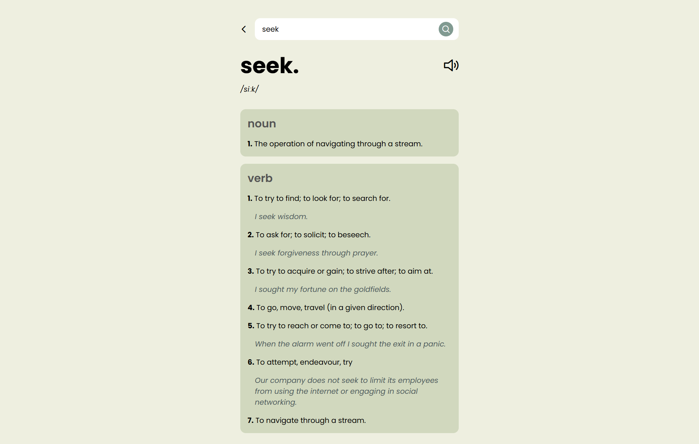

  

# 📚 Joshionary

Joshionary is a sleek and functional dictionary web app that lets you explore English words with ease. Whether you're searching for definitions, learning pronunciation, or checking out the word of the day — Joshionary has you covered.

## 🚀 Features

- 🔍 **Search Word**: Instantly find definitions, parts of speech, and examples.
- 📅 **Word of the Day**: Discover a new word each day to expand your vocabulary.
- 🔤 **Phonetics**: View the correct phonetic transcription of the word.
- 🔊 **Audio Pronunciation**: Hear how the word is properly pronounced.

## 🛠️ Built With

- Vue JS  
- PrimeVue
- Free Dictionary API

## 🌐 Live Demo

[Visit Joshionary](joshionary.vercel.app)

## 📸 Preview

### Home Screen

### Search Screen
